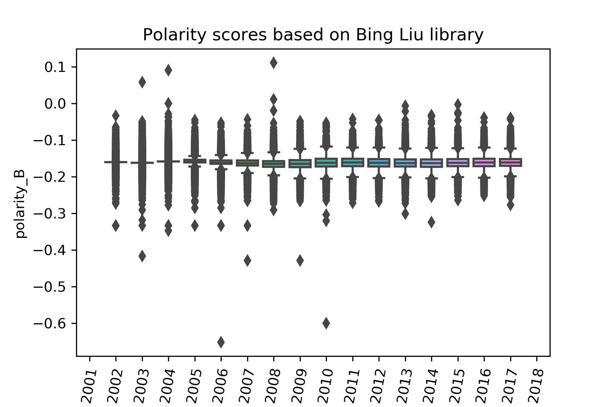

[](http://quantlet.de/)

## [](http://quantlet.de/) **SDA_2019_St_Gallen_PD_with_ML_and_Sentiment_Analysis_Descriptive_Statistics** [](http://quantlet.de/)

```yaml

Name of Quantlet: 'SDA_2019_St_Gallen_PD_with_ML_and_Sentiment_Analysis_Descriptive_Statistics'

Published in: 'SDA_2019_St_Gallen'

Description: 'Create summary statistics for financial ratios and make visualizations for macroeconomic indicators, polarity scores and overview of defaults'
            
Keywords: 'summary statistics, boxplot, areachart, linegraph, macroeconomic indicators, polarity scores, financial ratios'

Authors: 'Alexander Schade, Fabian Karst, Zhasmina Gyozalyan'

Submitted:   '25 November 2019'

Input: 'ratios.csv, macrodata_simple series.csv, filings_data_processed.csv, bl_data_processed.csv, cf_data_processed.csv, is_data_processed.csv, lbl_data_processed.csv'

Output:  'sumstat_ratios.xlsx, macro.png, fdi.png, polarLM.png, polarB.png, ByYear_extd.png, ByState_extd.png, BySector_extd.png'

```





### PYTHON Code
```python

# -*- coding: utf-8 -*-
"""
Created on Fri Nov  1 11:04:46 2019

@author: Fabian Karst
Input: bl_data_processed.csv, cf_data_processed.csv, is_data_processed.csv, lbl_data_processed.csv (from Preprocessing_WIDS.py and Labelgeneration_WIDS.py)
Output: Prints descriptive statistics and save diagrams showing the data.
Purpose: Create summary statistics and diagrams to get better understanding for the data.
"""
import os
import pandas as pd 
import matplotlib.pyplot as plt

# Set working directory
os.chdir('D:\Programming\Python\SmartDataAnalytics\Project\Preprocessing_WIDS')

df = [pd.read_csv("preprocesseddata//ratio//bl_data_processed.csv", low_memory=False, index_col = 0), pd.read_csv("preprocesseddata//ratio//cf_data_processed.csv", low_memory=False, index_col = 0), pd.read_csv("preprocesseddata//ratio//is_data_processed.csv", low_memory=False, index_col = 0), pd.read_csv("preprocesseddata//ratio//lbl_data_processed.csv", low_memory=False, index_col = 0)]    

#get descriptive statistics
for i in range(len(df)):
    print("\n Descriptive Statistics")
    print(df[i].describe())
    df[i].describe().to_csv("Descriptives/description_numerical_{}.csv".format(i))
    print("\n Data Types")
    print(df[i].dtypes.value_counts())
    df[i].dtypes.value_counts().to_csv("Descriptives/datatypes_{}.csv".format(i))

#group companies by year
dataByYear = df[0].groupby("fyear")["cik"].nunique()    
print(dataByYear)
plt.title(r'Companies by Year')
plt.bar(list(dataByYear.index), list(dataByYear))
plt.savefig("Descriptives/ByYear.png", transparent=True, dpi=300)
plt.show()

#group companies by year
allByYear = df[0].groupby("fyear")["cik"].nunique()
disapByYear = df[3].groupby("fyear")["disap"].value_counts()[:,1]
bnkrptByYear = df[3].groupby("fyear")["bnkrpt"].value_counts()[:,1]     
plt.title(r'Number of Companies by Year')
p1 = plt.bar(list(allByYear.index)[:-1], list(bnkrptByYear), color="red")
p2 = plt.bar(list(allByYear.index)[:-1], list(disapByYear-bnkrptByYear), bottom=list(bnkrptByYear), color="orange")
p3 = plt.bar(list(allByYear.index)[:-1], list(allByYear-disapByYear)[:-1], bottom=list(disapByYear))
plt.legend((p3[0], p2[0], p1[0]), ('Alive', 'Disappeared', 'Bankrupt'))
plt.savefig("Descriptives/ByYear_extd.png", transparent=True, dpi=300)
plt.show()

#group companies by state
dataByState = df[0].groupby("state")["cik"].nunique()    
print(dataByState)
plt.title(r'Companies by State')
plt.bar(list(dataByState.index), list(dataByState))
plt.xticks(rotation=90)
plt.savefig("Descriptives/ByState.png", transparent=True, dpi=300)
plt.show()

#group companies by state
df[0]["state"] = df[0]["state"].fillna("NON")
df[3]["state"] = df[3]["state"].fillna("NON")

allByState = pd.DataFrame(df[0].groupby("state")["cik"].nunique())
disapByState = pd.DataFrame(df[3].groupby("state")["disap"].value_counts()[:,1])
bnkrptByState = pd.DataFrame(df[3].groupby("state")["bnkrpt"].value_counts()[:,1])

dataByState = pd.merge(pd.merge(allByState, disapByState, how='outer', on='state'), bnkrptByState, how='outer', on='state').fillna(value=0)
     
plt.title(r'Number of Companies by State')
p1 = plt.bar(list(dataByState.index), list(dataByState["bnkrpt"]), color="red")
p2 = plt.bar(list(dataByState.index), list(dataByState["disap"]-dataByState["bnkrpt"]), bottom=list(dataByState["bnkrpt"]), color="orange")
p3 = plt.bar(list(dataByState.index), list(dataByState["cik"]), bottom=list(dataByState["disap"]))
plt.xticks(rotation=90)
plt.legend((p3[0], p2[0], p1[0]), ('Alive', 'Disappeared', 'Bankrupt'))
plt.savefig("Descriptives/ByState_extd.png", transparent=True, dpi=300)
plt.show()


#group companies by sector
sector_dict = {0: "No Sector", 10: "Energy", 15: "Materials", 20: "Industrials", 25: "Consumer Discretionary", 30: "Consumer Staples", 35: "Health Care", 40: "Financials", 45: "Information Technology", 50: "	Communication Services", 55: "Utilities", 60: "Real Estate"}
df[0]["gsector"] = df[0]["gsector"].fillna(0)
df[3]["gsector"] = df[3]["gsector"].fillna(0)
df[0]["gsector"] = df[0]["gsector"].map(lambda x: sector_dict[x])
df[3]["gsector"] = df[3]["gsector"].map(lambda x: sector_dict[x])

dataBySector = df[0].groupby("gsector")["cik"].nunique()    
print(dataBySector)
plt.title(r'Companies by Sector')
plt.bar(list(dataBySector.index), list(dataBySector))
plt.xticks(rotation=90)
plt.savefig("Descriptives/BySector.png", transparent=True, dpi=300)
plt.show()

#group companies by sector
allBySector = pd.DataFrame(df[0].groupby("gsector")["cik"].nunique())
disapBySector = pd.DataFrame(df[3].groupby("gsector")["disap"].value_counts()[:,1])
bnkrptBySector = pd.DataFrame(df[3].groupby("gsector")["bnkrpt"].value_counts()[:,1])

dataBySector = pd.merge(pd.merge(allBySector, disapBySector, how='outer', on='gsector'), bnkrptBySector, how='outer', on='gsector')
     
plt.title(r'Number of Companies by Sector')
p1 = plt.bar(list(dataBySector.index), list(dataBySector["bnkrpt"]), color="red")
p2 = plt.bar(list(dataBySector.index), list(dataBySector["disap"]-dataBySector["bnkrpt"]), bottom=list(dataBySector["bnkrpt"]), color="orange")
p3 = plt.bar(list(dataBySector.index), list(dataBySector["cik"]), bottom=list(dataBySector["disap"]))
plt.xticks(rotation=90)
plt.legend((p3[0], p2[0], p1[0]), ('Alive', 'Disappeared', 'Bankrupt'))
plt.savefig("Descriptives/BySector_extd.png", transparent=True, dpi=300)
plt.show()

```

automatically created on 2019-12-02