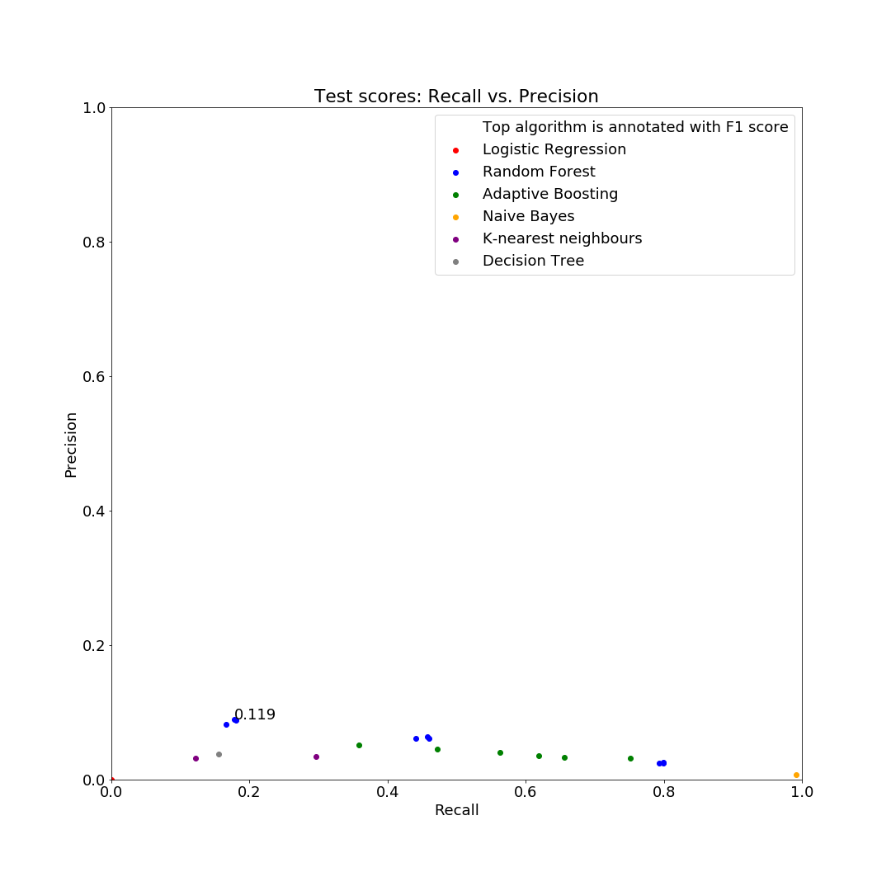
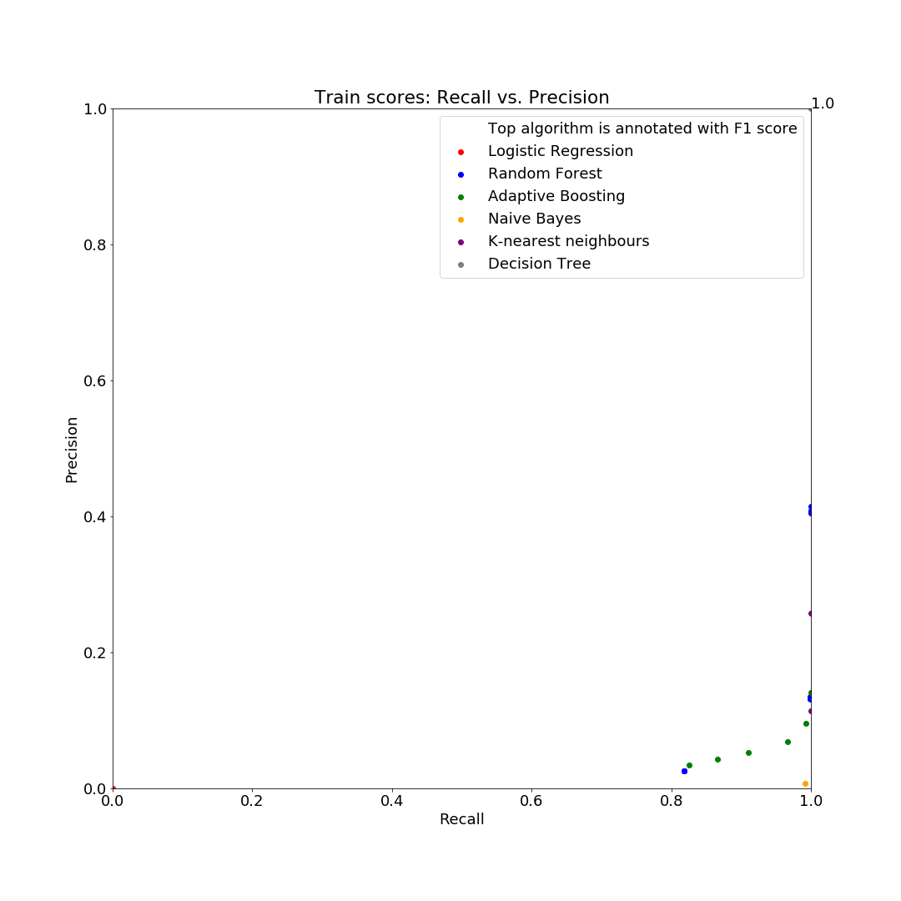

[](http://quantlet.de/)

## [](http://quantlet.de/) **SDA_2019_St_Gallen_PD_with_ML_and_Sentiment_Analysis_Machine_Learning** [](http://quantlet.de/)

```yaml

Name of Quantlet: 'SDA_2019_St_Gallen_PD_with_ML_and_Sentiment_Analysis_Machine_Learning'

Published in: 'SDA_2019_St_Gallen'

Description: 'Implement machine learning algorithms for default prediction '
            
Keywords: 'machine learning, logistic regression, random forest, naive bayes classifier, adaptive boosting, decision tree, k-nearest neighbor classifier'

Authors: 'Alexander Schade, Fabian Karst, Zhasmina Gyozalyan'

Submitted:   '25 November 2019'

Input: 'X_train, y_train, X_test, y_test'

Output:  'trained model'

```







### PYTHON Code
```python

# -*- coding: utf-8 -*-
"""
Created on Mon Nov 25 13:54:19 2019

@author: KAT
Input: X_train, y_train, X_test, y_test
Output: trained model
Purpose: Train and evaluate the final model and save this model
"""

import pickle
import pandas as pd
from sklearn.linear_model import LogisticRegression
from sklearn.ensemble import RandomForestClassifier
from sklearn.ensemble import AdaBoostClassifier
from sklearn.svm import SVC
from sklearn.naive_bayes import GaussianNB
from sklearn.neighbors import KNeighborsClassifier
from sklearn.model_selection import GridSearchCV
from sklearn.metrics import accuracy_score, f1_score, auc, precision_score, recall_score


#load the data
X_train = pd.read_csv(r"...\X_all_train_RNOS.csv", low_memory=False, index_col = 0).iloc[:, 2:]
y_train = pd.read_csv(r"...\y_train_RNOS.csv", low_memory=False, index_col = 0).squeeze()
X_test = pd.read_csv(r"...\X_all_test.csv", low_memory=False, index_col = 0).iloc[:, 2:]
y_test = pd.read_csv(r"...\y_test.csv", low_memory=False, index_col = 0).squeeze()


#set a random state
randomstate = 38

#train model
clf = RandomForestClassifier(random_state=randomstate, n_estimators=800, max_depth=20)
clf.fit(X_train, y_train)

#test model
y_pred = clf.predict(X_test)

#calculate scores
result = {}
result["acc"] = accuracy_score(y_test, y_pred)
result["prec"] = precision_score(y_test, y_pred)
result["rec"] = recall_score(y_test, y_pred)
result["f1"] = f1_score(y_test, y_pred)

#print scores
for key in result.keys():
    print("{}: {}".format(key, result[key]))

#save classifier
filename = r'...\prediction_model.sav'
pickle.dump(clf, open(filename, 'wb'))


```

automatically created on 2019-12-02